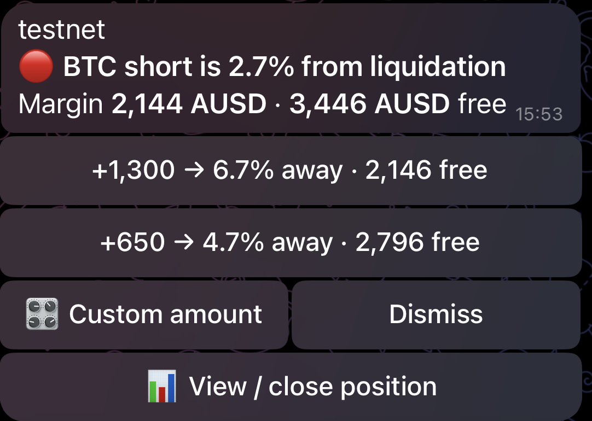
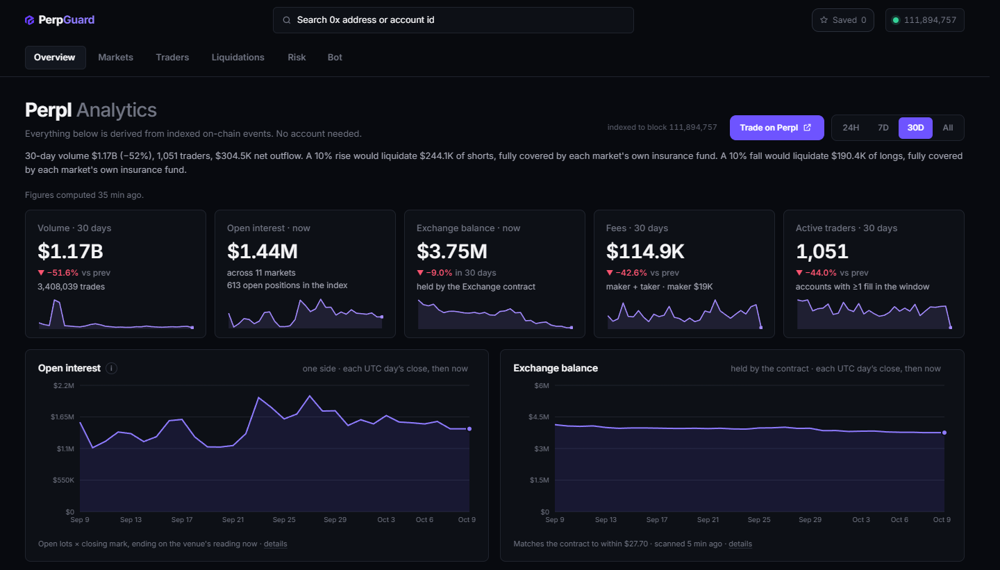
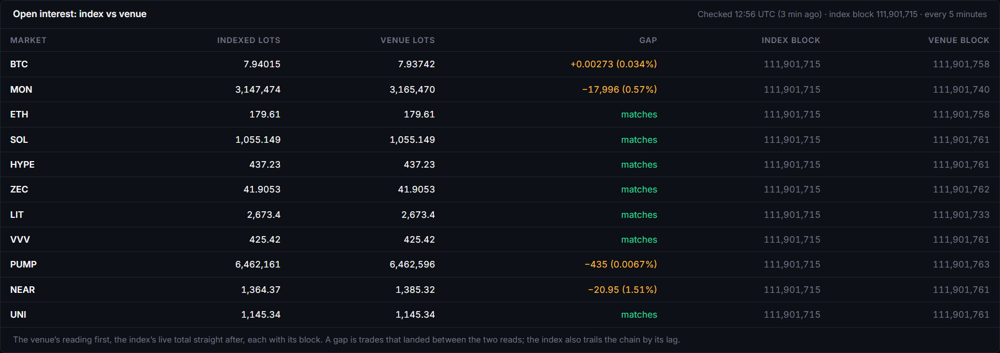

# PerpGuard

Real-time liquidation risk and intervention for Perpl traders on Monad.

[perpguard.app](https://perpguard.app) · [@PerpGuardBot on Telegram](https://t.me/PerpGuardBot) · [Data & Methodology (/status)](https://perpguard.app/status) · [Bot setup guide (/bot/guide)](https://perpguard.app/bot/guide)



## Overview

Perpl uses isolated margin: each position has its own collateral, and the
account's free balance is never used to save it. Traders are liquidated while
holding enough spare AUSD to have kept the position open, because nobody was
watching. Of 3,653 mainnet liquidations since Perpl launched on 11 Feb 2026,
2,426 (66.4%) were on accounts whose free balance would have covered the
top-up that kept the position above maintenance margin; over the last 30 days
it is 428 of 634 (67.5%). PerpGuard watches each position, warns before
liquidation, and adds margin only if the trader has turned that on for that
position. It is for anyone trading on Perpl, and for anyone who wants to watch
an account on Perpl without trading.

## What it does

**Analytics.** A public, read-only website over a full-history index of the
Perpl Exchange on Monad mainnet: Overview, Markets (with a funding heatmap and
a comparison against Hyperliquid and Binance), Traders, Liquidations, Risk,
and a profile per account. No sign-in.

**Risk.** Every open position on mainnet is re-priced at each half-percent move
from −50% to +50%. The Risk page shows how much a 5% or 10% move would
liquidate in each direction, the losses beyond collateral, and each market's
insurance fund against them.

**The bot.** [@PerpGuardBot](https://t.me/PerpGuardBot) has two tiers.

- *Watch, for anyone.* Send it any mainnet address or account number. It
  re-reads the account every 30 seconds and warns at the distances you choose
  (Standard: 10% and 5% from liquidation). It also reports liquidations and
  large trades above thresholds you set. Watched accounts get words only:
  there is nothing to press.
- *Act, for a linked account.* Link your Perpl account on
  [perpguard.app/link](https://perpguard.app/link). At your alert distance
  (5% by default; 2, 3, 5, 8 or 10%, or a custom value from 0.5% to 20%) the
  bot sends one message per position per crossing, with +100 AUSD, +250 AUSD
  and a custom amount. A tap shows the margin, liquidation price, distance and
  free balance before and after; nothing is sent until you confirm.
  📊 My positions lists every position closest to liquidation first, each
  amount showing the distance it buys, with 🚪 Close position behind a
  confirmation that shows what the close realises.
- *Rescue, off until you turn it on.* 🤖 Auto adds margin by itself at your
  alert distance, for one position at a time, only after you arm it with a tap
  in the linked chat.

**Safety.** See [Safety model](#safety-model).



## Data and provenance

| | Mainnet (analytics, watch tier) | Testnet (actions) |
| --- | --- | --- |
| Chain id | 143 | 10143 |
| Perpl Exchange (proxy) | `0x34B6552d57a35a1D042CcAe1951BD1C370112a6F` | `0x1964C32f0bE608E7D29302AFF5E61268E72080cc` |

- The index starts at block **54,773,010**, the Exchange proxy's deployment
  block on Monad mainnet (11 Feb 2026), so every liquidation can be judged.
- It handles **42 of the Exchange's 204 event types**: market listings and
  margin parameters, accounts and deposits, every position change, margin
  added and removed, liquidations and other forced exits, maker and taker
  fills, mark updates and funding settlements. Each event's handling is listed
  in [`apps/indexer/docs/EVENTS.md`](apps/indexer/docs/EVENTS.md).
- On 9 Oct 2026, at block 111,884,822, Envio had processed **83.0 million
  events**, and the index held 7,563,875 positions and 3,653 liquidations.
- What it stores (`apps/indexer/schema.graphql`): markets, traders, positions,
  fills, liquidations, margin actions, collateral flows, funding events, and
  per-day aggregates per market and per trader.
- Market ids, tick sizes and scaling are read from Perpl's
  `GET /v1/pub/context`, never hard-coded.

## Accuracy

Every figure on the site names its window, and [/status](https://perpguard.app/status)
names the code that computes each one. The checks below were run on
9 Oct 2026 unless a date says otherwise.

- **The index matches the venue.** Every 5 minutes the backend reads open
  interest from Perpl's API and, straight after, from the index, each with its
  block. At 11:31 UTC the index was at block 111,884,822 and the venue's
  readings at blocks 111,884,763 to 111,884,859: 10 of 11 markets matched to
  the lot; the largest gap was PUMP, 0.25% (17,096 lots), read 23 blocks after
  the index. The per-market table is on /status.

  

- **Funding settles every 2,580 seconds, about 43 minutes, not hourly.** That
  is `funding_interval_sec` on all 11 markets in Perpl's live context. Over the
  last 24 hours the index recorded 512 settlement intervals with a median of
  2,588 s (2,587 to 2,592).
- **Adding margin reports failure while applying in full.** On Perpl testnet,
  `IncreasePositionCollateral` returned `st: 7 Failed, sr: 32
  OrderDescIdTooLow` while the margin was credited to the micro, four times out
  of four (29–30 Sep 2026; frames in
  [`fixtures/live-action-run-testnet.json`](fixtures/live-action-run-testnet.json),
  table in [`docs/evidence.md`](docs/evidence.md)). PerpGuard therefore judges
  a top-up by the position's margin before and after, never by the receipt,
  and never re-sends on that report.
- **Not every trader's books reconcile.** For the top 10 accounts by 30-day net
  P&L, the copy replay rebuilds each balance from indexed events and compares it
  with the index's own (free balance plus open margin). Four have more than
  3,000 opens in 30 days and are not replayed. Of the other six, one matches
  exactly (#4532) and five do not, by 2,007.39, 1,077.22, 12.30, −10.42 and
  −9.42 AUSD. The page says NOT RECONCILED, with the gap, before any figure.
- **The index records no per-position fees.** `Position.feesCNS` is empty on
  all 7,563,875 indexed positions; fees exist per account per UTC day. Win
  rate, best and worst round trip and profit factor are therefore before fees,
  and the site labels them so.

## Safety model

- **Trade-only key.** A Perpl API key can place, cancel and change orders and
  add margin. Perpl does not allow withdrawals or transfers out with an API key
  of any scope ([Perpl docs](https://docs.perpl.xyz/resources/for-developers/api/authentication.md)).
  The key is sealed at rest with AES-256-GCM, is never sent back to a browser
  and is never logged.
- **Nothing automatic by default.** Alerts carry buttons; every amount needs a
  second tap to confirm. Auto is off on every position until the owner arms it
  with a tap in the linked chat. The rule is signed when armed, and a rule that
  was written any other way (a script, a database edit) is switched off.
- **Rescue limits.** Each armed position has four limits: maximum top-ups,
  maximum total, a minimum free balance that is never spent, and a cooldown.
  One rescue runs at a time per account, and amounts in flight are reserved
  against the free balance.
- **The kill switch.** 🆘 Kill switch → "Stop automation only" writes a flag
  in PerpGuard's database, switches off every Rescue rule, and sends nothing to
  the exchange, so it works with the connection down. "Stop everything" stops
  automation first, then closes each position once, after a confirmation that
  shows what it costs.
- **Actions run on testnet.** Analytics and the watch tier read mainnet.
  Margin, close and Rescue act on Perpl testnet; mainnet trading is off unless
  the operator sets `PERPGUARD_MAINNET_TRADING=1`.
- **One network per risk loop.** A position is only ever priced against marks
  from its own network; the code refuses to build anything else.

## Dynamic

[perpguard.app/link](https://perpguard.app/link) uses Dynamic (connect-only)
to connect the wallet. The backend generates an Ed25519 key, asks Perpl for the
enrolment payload, and the wallet signs Perpl's EIP-712 typed data once. The
backend verifies the signature (smart-contract wallets too), enrols the key with
Perpl, signs in with it to learn the account, and seals it. The key's secret
never reaches the browser and nobody copies a key by hand. A held key that
still works is reused instead of creating another. Pasting an existing key
remains available.

## How it works

```
 Monad mainnet                          Perpl API (REST + WebSocket)
 Perpl Exchange proxy                     │ marks, positions, orders
      │ HyperSync                         │
      ▼                                   ▼
 apps/indexer ──▶ Postgres ◀──────── apps/backend ──▶ Telegram
 Envio            index +            Fastify API,      (grammY bot,
 HyperIndex       PerpGuard's        risk loops,        in-process)
                  own tables         alerts, Rescue
                                          │
                                          │ /api/analytics/*
                                          ▼
                                     apps/web (Next.js) ──▶ perpguard.app
```

TypeScript throughout, in a pnpm workspace. Node 22, PostgreSQL 16,
Envio HyperIndex 3.12.1, Fastify 5.12, grammY 1.46, Next.js 15.5 with React
19.3, Tailwind CSS 4.3, Recharts 3.10, viem 2.56, Dynamic SDK 5.9,
TypeScript 5.9.

## Run it

Needs Node 22.9 or later, pnpm, PostgreSQL 16, an
[Envio HyperSync token](https://docs.envio.dev/docs/HyperSync/api-tokens), and,
for the bot, a Telegram bot token from @BotFather.

```sh
git clone https://github.com/0xMigzy/PerpGuard.git && cd PerpGuard && pnpm install
cp .env.example .env    # fill in the Postgres, HyperSync and Telegram values it lists
pnpm --filter @perpguard/indexer codegen && ENVIO_PERPGUARD_START_BLOCK=54773010 pnpm --filter @perpguard/indexer start
pnpm start & pnpm web   # backend on :8080, then open http://localhost:3000
```

The full backfill from block 54,773,010 took about 14 hours on a 2-vCPU server
(1 Oct 2026, 06:12 to 20:28 UTC) and the index is 15 GB today. The site serves
figures as soon as the index has data; it catches up block by block.

## Where to look in the code

- `apps/indexer/src/handlers/` — the Envio handlers: positions, fills, liquidations, margin, funding.
- `packages/shared/src/risk/liquidation.ts` — liquidation price and signed buffer, pure functions.
- `packages/shared/src/analytics/exposure.ts` — the ±50% ladder behind the Risk page.
- `packages/shared/src/venues/perpl.ts` — the Perpl venue: signing, sending, reconciling an action against the position.
- `apps/backend/src/rescue/decide.ts` — the pure decision for an automatic top-up, limits first.
- `apps/backend/src/rescue/killSwitch.ts` — the stop that sends nothing to the exchange.
- `apps/backend/src/server/link/walletKey.ts` — one wallet signature to an enrolled, sealed key.
- `apps/web/src/lib/statusContent.ts` — every figure's method, as /status shows it.

## Tests

```sh
pnpm test        # node:test across every package and app
pnpm typecheck
```

1,552 tests, all passing on 9 Oct 2026. CI runs both and a clean web build on
every push.

## After the hackathon

- Trading on mainnet, once Perpl has approved PerpGuard as an integrating site.
- Quiet hours and a daily summary in the bot.
- A page per market.

## Monad Metropolis

Track 01, Onchain Finance & Trading. Bounties: Envio, Perpl analytics and
risk, Perpl API, Dynamic.

## Credits

Built on Envio HyperIndex, Fastify, grammY, Next.js, React, Tailwind CSS,
Recharts, viem and Dynamic. Token icons are from Cryptocurrency Icons (CC0),
Trust Wallet assets (MIT) and the projects' own brand pages; sources are in
[`apps/web/public/tokens/SOURCES.md`](apps/web/public/tokens/SOURCES.md).

An AI coding assistant helped write the code, tests and documentation. The
research, design, data validation and review are mine.

PerpGuard is not affiliated with or endorsed by Perpl or the Monad Foundation.

Released under the [MIT License](LICENSE).
