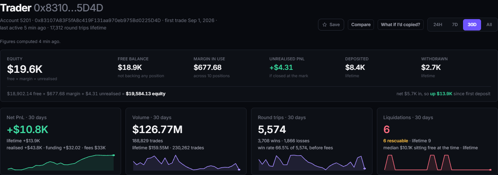

# PerpGuard

[perpguard.app](https://perpguard.app) · [@PerpGuardBot](https://t.me/PerpGuardBot) · [Data & methodology](https://perpguard.app/status) · [Setup guide](https://perpguard.app/bot/guide)

## Overview

Perpl uses isolated margin: each position carries its own collateral, and the account's free balance is never used to save it. So traders get liquidated while holding spare AUSD that would have kept the position open, because nobody was watching.

Since Perpl launched on 11 Feb 2026, 2,426 of 3,653 mainnet liquidations (66.4%) hit accounts whose free balance could have covered the top-up that would have kept the position above maintenance margin. Over the last 30 days: 428 of 634 (67.5%).


*A trader's page: their liquidations over the window, and how many their free balance could have prevented.*

PerpGuard watches each position and warns before liquidation. It adds margin only if the trader has turned that on, for that position.

For anyone trading on Perpl, and for anyone who wants to watch an account on Perpl without trading at all.

<br>
*The alert: the position, its margin and free balance, and two top-ups, each showing the distance it buys.*

## What it does


*The Overview on perpguard.app: volume, fees and active traders over the window picked; open interest and the exchange balance now.*

**Analytics.** A public, read-only site built on a full-history index of the Perpl Exchange on Monad mainnet: Overview, Markets (with a funding heatmap and a comparison against Hyperliquid and Binance), Traders, Liquidations, Risk, and a profile for every account. No sign-in.

**Risk.** Every open position on mainnet is re-priced at each half-percent step from −50% to +50%. The Risk page shows what a 5% or 10% move would liquidate in each direction, the losses beyond collateral, and each market's insurance fund against them.

**The bot.** [@PerpGuardBot](https://t.me/PerpGuardBot) has two tiers.

**Watch, for anyone.** Send it any mainnet address or account number. It re-reads the account every 30 seconds and warns at the distances you choose (Standard: 10% and 5% from liquidation). It also reports liquidations and large trades above thresholds you set. Watched accounts get words only. There is nothing to press.

**Act, for a linked account.** Link your Perpl account at [perpguard.app/link](https://perpguard.app/link). At your alert distance (5% by default, or 2, 3, 5, 8, 10%, or anything from 0.5% to 20%) the bot sends one message per position per crossing, with up to two top-ups that fit the free balance and a custom amount. Each amount shows the distance from liquidation it buys. Tapping one shows the margin, liquidation price, distance and free balance before and after. Nothing is sent until you confirm.

📊 My positions shows one button per position, closest to liquidation first. 🚪 Close position is on each position's own screen: it offers 25%, 50%, 75%, a custom percentage or closing everything, each behind a confirmation showing what the close would realise.

🤖 Rescue is off until you turn it on. It adds margin by itself at your alert distance, for one position at a time, and only after you arm it with a tap in the linked chat.

**Safety.** See [Safety model](#safety-model).

## Using it

Alerts need no setup: send [@PerpGuardBot](https://t.me/PerpGuardBot) any Perpl mainnet address, or `/watch` and an account number, and it starts watching.

To let it act for you, the five-step setup is at [perpguard.app/bot/guide](https://perpguard.app/bot/guide).

## Data and provenance

| | Mainnet (analytics, watch tier) | Testnet (actions) |
| --- | --- | --- |
| Chain id | 143 | 10143 |
| Perpl Exchange (proxy) | `0x34B6552d57a35a1D042CcAe1951BD1C370112a6F` | `0x1964C32f0bE608E7D29302AFF5E61268E72080cc` |

**History.** The index starts at block 54,773,010, the Exchange proxy's deployment block on Monad mainnet (11 Feb 2026). Every liquidation since launch can be judged.

**Events.** 42 of the Exchange's 204 event types are handled: market listings and margin parameters, accounts and deposits, every position change, margin added and removed, liquidations and other forced exits, maker and taker fills, mark updates, and funding settlements. How each one is handled is listed in `apps/indexer/docs/EVENTS.md`.

**Scale.** On 9 Oct 2026, at block 111,884,822, Envio had processed 83.0 million events. The index held 7,563,875 positions and 3,653 liquidations.

**What it stores** (`apps/indexer/schema.graphql`): markets, traders, positions, fills, liquidations, margin actions, collateral flows, funding events, and per-day aggregates by market and by trader.

**Market parameters.** Market ids, tick sizes and scaling are read from Perpl's `GET /v1/pub/context`, never hard-coded.

## Accuracy

Every figure on the site names its window, and [/status](https://perpguard.app/status) names the code that computes each one. The checks below were run on 9 Oct 2026 unless a date says otherwise.


*Open interest per market, the index beside the venue, each with the block it was read at.*

**The index matches the venue.** Every 5 minutes the backend reads open interest from Perpl's API and, straight after, from the index, each with its block. In the reading above, at 12:56 UTC, the index was at block 111,901,715 and the venue's readings at blocks 111,901,733 to 111,901,763. Seven of 11 markets matched to the lot. The largest gap was NEAR, 1.51% (20.95 lots), then MON 0.57% and BTC 0.034%. The count varies from one check to the next (10 of 11 matched at 11:31 the same day): a gap is trades that landed in the seconds between the two reads. The per-market table is live on /status.

**Funding settles every 2,580 seconds, about 43 minutes, not hourly.** That is `funding_interval_sec` on all 11 markets in Perpl's live context. Over the last 24 hours the index recorded 512 settlement intervals with a median of 2,588 s (range 2,587 to 2,592).

**Adding margin reports failure while applying in full.** On Perpl testnet, `IncreasePositionCollateral` returned `st: 7 Failed, sr: 32 OrderDescIdTooLow` while the margin was credited to the micro, four times out of four (29 to 30 Sep 2026; frames in `fixtures/live-action-run-testnet.json`, table in `docs/evidence.md`). PerpGuard therefore judges a top-up by the position's margin before and after, never by the receipt, and never re-sends on that report.

**Not every trader's books reconcile.** For the top 10 accounts by 30-day net P&L, the replay rebuilds each balance from indexed events and compares it with the index's own (free balance plus open margin). Four have more than 3,000 opens in 30 days and are not replayed. Of the other six, one matches exactly (#4532) and five do not, by 2,007.39, 1,077.22, 12.30, −10.42 and −9.42 AUSD. The page says NOT RECONCILED, with the gap, before any figure.

**The index records no per-position fees.** `Position.feesCNS` is empty on all 7,563,875 indexed positions; fees exist per account per UTC day. Win rate, best and worst round trip, and profit factor are therefore before fees, and the site labels them so.

## Safety model

**Trade-only key.** A Perpl API key can place, cancel and change orders, and add margin. Perpl does not allow withdrawals or transfers out with an API key of any scope ([Perpl docs](https://docs.perpl.xyz/resources/for-developers/api/authentication.md)). The key is sealed at rest with AES-256-GCM, is never sent back to a browser, and is never logged.

**Nothing automatic by default.** Alerts carry buttons, and every amount needs a second tap to confirm. Rescue is off on every position until the owner arms it with a tap in the linked chat. The rule is signed when armed, and a rule written any other way (a script, a database edit) is switched off.

**Rescue limits.** Each armed position has four: maximum top-ups, maximum total, a minimum free balance that is never spent, and a cooldown. One rescue runs at a time per account, and amounts in flight are reserved against the free balance.

**The kill switch.** 🆘 Kill switch → "Stop automation only" writes a flag in PerpGuard's database, switches off every Rescue rule, and sends nothing to the exchange, so it works with the connection down. "Stop everything" stops automation first, then closes each position once, after a confirmation showing what it costs.

**Actions run on testnet.** Analytics and the watch tier read mainnet. Margin, close and Rescue act on Perpl testnet. Mainnet trading is off unless the operator sets `PERPGUARD_MAINNET_TRADING=1`.

**One network per risk loop.** A position is only ever priced against marks from its own network. The code refuses to build anything else.

### Dynamic

[perpguard.app/link](https://perpguard.app/link) uses Dynamic to connect the wallet. The backend generates an Ed25519 key, asks Perpl for the enrolment payload, and the wallet signs Perpl's EIP-712 typed data once. The backend verifies the signature (smart-contract wallets included), enrols the key with Perpl, signs in with it to learn the account, and seals it.

The key's secret never reaches the browser, and nobody copies a key by hand. A held key that still works is reused rather than creating another. Pasting an existing key remains available.

## How it works

```text
 Monad mainnet (143)      Perpl API, mainnet      Perpl API, testnet (10143)
 Perpl Exchange proxy     marks, market context   positions, balances, outcomes
        │                         │                    │              ▲
        │ HyperSync               │ reads              │ reads        │ writes: add margin, close
        ▼                         ▼                    ▼              │ (Ed25519-signed, forwarded)
 apps/indexer             apps/backend ───────────────────────────────┘
 Envio HyperIndex         Fastify API, risk loops, alerts,
        │                 Rescue, kill switch ─────────▶ Telegram (grammY bot, in-process)
        ▼                         │
 Postgres ◀───────────────────────┤ reads the index, keeps PerpGuard's own tables
 index + PerpGuard's tables       │
                                  │ /api/analytics/* (read-only)
                                  ▼
                          apps/web (Next.js) ──▶ perpguard.app
```

TypeScript throughout, in a pnpm workspace. Node 22, PostgreSQL 16, Envio HyperIndex 3.12.1, Fastify 5.12, grammY 1.46, Next.js 15.5 with React 19.3, Tailwind CSS 4.3, Recharts 3.10, viem 2.56, Dynamic SDK 5.9, TypeScript 5.9.

## Run it

Needs Node 22.9 or later, pnpm, PostgreSQL 16, an [Envio HyperSync token](https://docs.envio.dev/docs/HyperSync/api-tokens), and, for the bot, a Telegram bot token from @BotFather.

```bash
git clone https://github.com/0xMigzy/PerpGuard.git && cd PerpGuard && pnpm install
cp .env.example .env    # fill in the Postgres, HyperSync and Telegram values it lists
pnpm --filter @perpguard/indexer codegen && ENVIO_PERPGUARD_START_BLOCK=54773010 pnpm --filter @perpguard/indexer start
pnpm start & pnpm web   # backend on :8080, then open http://localhost:3000
```

The full backfill from block 54,773,010 took about 14 hours on a 2-vCPU server (1 Oct 2026, 06:12 to 20:28 UTC) and the index is 15 GB today. The site serves figures as soon as the index has data; it catches up block by block.

## Where to look in the code

- `apps/indexer/src/handlers/` — the Envio handlers: positions, fills, liquidations, margin, funding.
- `packages/shared/src/risk/liquidation.ts` — liquidation price and signed buffer, pure functions.
- `packages/shared/src/analytics/exposure.ts` — the ±50% ladder behind the Risk page.
- `packages/shared/src/venues/perpl.ts` — the Perpl venue: signing, sending, reconciling an action against the position.
- `apps/backend/src/rescue/decide.ts` — the pure decision for an automatic top-up, limits first.
- `apps/backend/src/rescue/killSwitch.ts` — the stop that sends nothing to the exchange.
- `apps/backend/src/server/link/walletKey.ts` — one wallet signature to an enrolled, sealed key.
- `apps/web/src/lib/statusContent.ts` — every figure's method, as /status shows it.

## Tests

```bash
pnpm test        # node:test across every package and app
pnpm typecheck
```

1,596 tests, all passing on 10 Oct 2026. CI runs both and a clean web build on every push.

## After the hackathon

* Liquidation Rescue on mainnet.
* Copy trading.
* Exploring funding arbitrage and delta-neutral positions across other perp venues.

## Monad Metropolis

Track 01, Onchain Finance & Trading. Bounties: Envio, Perpl analytics and risk, Perpl API, Dynamic.

## Credits

Built on Envio HyperIndex, Fastify, grammY, Next.js, React, Tailwind CSS, Recharts, viem and Dynamic. Token icons are from Cryptocurrency Icons (CC0), Trust Wallet assets (MIT) and the projects' own brand pages; sources are in `apps/web/public/tokens/SOURCES.md`.

An AI coding assistant helped write the code, tests and documentation. The research, design, data validation and review are mine.

PerpGuard is not affiliated with or endorsed by Perpl or the Monad Foundation.

Released under the [MIT License](LICENSE).
